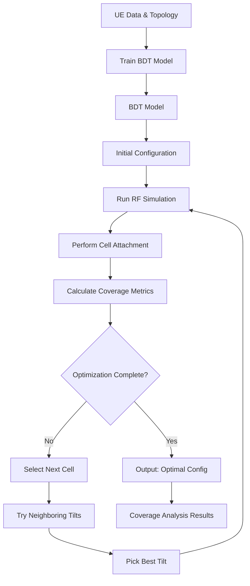

# Coverage Capacity Optimization (CCO) Application

**Version:** 1.0
**Date:** December 3, 2025

---

## 1. Overview

The **Coverage Capacity Optimization (CCO)** application intelligently adjusts cellular antenna tilt angles to provide better network coverage where it's needed most. By analyzing real-time traffic patterns and user locations, the system automatically reconfigures antennas throughout the day to follow population movements—ensuring strong signals in busy areas while minimizing interference and weak coverage zones.

The system uses **Bayesian Digital Twin (BDT)** models to predict signal strength and the **dGPCO (distributed Greedy Policy Coordinate descent Optimization)** algorithm to find the best antenna configurations. Unlike RL-based applications, CCO uses an iterative greedy optimization approach, testing different tilt angles in a round-robin fashion to maximize network coverage utility.

---

## 2. Key Features

- **Distributed Greedy Optimization:** Uses dGPCO algorithm for iterative, deterministic antenna tilt optimization without requiring RL training.
- **Coverage-Focused Metrics:** Balances weak coverage minimization with over-coverage interference reduction.
- **BDT-based RF Simulation:** Leverages pre-trained Bayesian Digital Twin models for accurate signal strength prediction.
- **Traffic-Aware Optimization:** Optionally weights coverage metrics by traffic patterns to prioritize high-density areas.
- **Flexible Configuration:** Supports customizable coverage thresholds, lambda weighting, and tilt angle search spaces.
- **Pre-populated Data:** All required data files are included in the repository—no data generation needed.

---

## 3. System Architecture

The CCO application follows an iterative optimization pipeline:



---

## 4. Directory Structure

```
coverage_capacity_optimization/
│
├── cco_engine.py              # Core CCO utilities and metric calculations
├── dgpco_cco.py               # dGPCO optimization algorithm implementation
├── cco_example_app.py         # Example application workflow
├── cco_anp_app.py            # Advanced ANP simulation workflow
├── constants.py               # Application constants and parameters
│
├── data/                      # Input data files (pre-populated)
│   ├── topology.csv               # Cell tower layout and configuration
│   ├── config.csv                 # Initial antenna tilt configuration
│   ├── ue_data.csv                # User equipment location data
│   ├── ue_training_data.csv       # BDT model training data
│   └── ue_data_geo_only.csv       # Simplified UE location data
│
└── tests/                     # Unit tests
    └── test_cco_engine.py         # CCO engine unit tests
```

**Note:** Unlike other rApp applications, CCO data is **already included** in the `data/` directory. No zip extraction or data generation is required.

---

## 5. Prerequisites

- Go to project root

  ```bash
  cd path/to/maveric
  ```

- **Python 3.9-3.10:** Create venv and activate:

  Example: Ensure shell has `python3.10`

  ```bash
  python3.10 -m venv .venv
  source .venv/bin/activate
  python --version  # should report Python 3.10.16
  ```

- Configure Python Path

  ```bash
  # from maveric root
  export PYTHONPATH="$(pwd)":$PYTHONPATH
  ```

- **Docker:** BDT model training runs inside a Docker container. Ensure Docker daemon is running.

  Note: Refer [maveric/README.md ### Booting up RADP](../../README.md#booting-up-radp) for host GPU utilization.

  ```bash
  # Set dev port first if using dev mode
  cp .env-dev .env
  ```

  ```bash
  # from maveric root
  docker build -t radp radp
  docker compose -f dc.yml -f dc-dev.yml up -d --build
  ```

- **Required Python Packages:**

  ```bash
  # from maveric root
  pip install -r radp/client/requirements.txt
  pip install -r apps/requirements.txt
  ```

- **Data Files:** All required data is pre-populated in `apps/coverage_capacity_optimization/data/`:
  - `topology.csv` - Cell tower locations and parameters
  - `config.csv` - Initial antenna tilt configuration
  - `ue_data.csv` - User equipment location data
  - `ue_training_data.csv` - Training data for BDT model

---

## 6. Application Workflow & Usage

> cd apps/coverage_capacity_optimization

### **Quick Start: Run Example Application**

The simplest way to get started is to run the example application:

```bash
python cco_example_app.py
```

This will:
1. Load input data from `data/` directory
2. Train a Bayesian Digital Twin model
3. Run the dGPCO CCO algorithm for 20 epochs
4. Output optimization results

**Expected Output:**
```
----- rf_dataframe_per_epoch -----
[DataFrame with RF predictions for each optimization epoch]

----- coverage_dataframe_per_epoch -----
[DataFrame with coverage analysis for each epoch]

----- cco_objective_per_epoch -----
[List of CCO metric values showing optimization progress]

----- opt_per_epoch -----
[Array showing antenna tilt values per cell per epoch]
```

---

### **Step-by-Step Custom Usage**

For custom CCO optimization, follow these steps:

### **Step 1: Train the Bayesian Digital Twin (BDT)**

The BDT model learns to predict RF signal strength based on UE location and cell configuration.

**Prerequisites:** Docker container (e.g., `radp_dev-training-1` for dev mode, `radp_prod-training-1` for prod) must be running.

```python
from radp.client.client import RADPClient
from radp.client.helper import RADPHelper, ModelStatus
import pandas as pd

# Load data
topology = pd.read_csv("data/topology.csv")
training_data = pd.read_csv("data/ue_training_data.csv")

# Initialize RADP client
radp_client = RADPClient()
radp_helper = RADPHelper(radp_client)

# Train BDT model
MODEL_ID = "cco_test_model"
train_response = radp_client.train(
    model_id=MODEL_ID,
    params={},
    ue_training_data=training_data,
    topology=topology,
)

# Wait for training to complete
model_status = radp_helper.resolve_model_status(
    MODEL_ID,
    wait_interval=3,
    max_attempts=10,
    verbose=True
)

if not model_status.success:
    print(f"Training failed: {model_status.error_message}")
```

- **Inputs:** `data/topology.csv`, `data/ue_training_data.csv`
- **Output:** Trained BDT model registered with `MODEL_ID`

---

### **Step 2: Configure dGPCO CCO Parameters**

Set up the optimization algorithm parameters:

```python
from apps.coverage_capacity_optimization.dgpco_cco import DgpcoCCO

# Define valid antenna tilt angles (degrees)
VALID_CONFIGURATION_VALUES = {
    "cell_el_deg": [
        0.0, 1.0, 2.0, 3.0, 4.0, 5.0, 6.0, 7.0, 8.0, 9.0, 10.0,
        11.0, 12.0, 13.0, 14.0, 15.0, 16.0, 17.0, 18.0, 19.0, 20.0
    ]
}

# Load prediction data
prediction_data = pd.read_csv("data/ue_data.csv")
prediction_config = pd.read_csv("data/config.csv")

# Initialize dGPCO CCO
dgpco_cco = DgpcoCCO(
    topology=topology,
    valid_configuration_values=VALID_CONFIGURATION_VALUES,
    bayesian_digital_twin_id=MODEL_ID,
    ue_data=prediction_data,
    config=prediction_config,
)
```

---

### **Step 3: Run CCO Optimization**

Execute the dGPCO algorithm:

```python
# Run optimization for 20 epochs
(
    rf_dataframe_per_epoch,
    coverage_dataframe_per_epoch,
    cco_objective_per_epoch,
    opt_per_epoch,
) = dgpco_cco.run(
    num_epochs=20,                    # Number of optimization iterations
    lambda_=0.5,                      # Weight: weak vs. over-coverage (0-1)
    weak_coverage_threshold=-90,      # RSRP threshold for weak coverage (dBm)
    over_coverage_threshold=0,        # SINR threshold for over-coverage (dB)
    seed=0,                           # Random seed for reproducibility
    epsilon=0,                        # Exploration rate (0=greedy, >0=random)
    opt_delta=(-4, -3, -2, -1, 0, 1, 2, 3, 4),  # Tilt deltas to try
)
```

**Parameters:**
- **num_epochs:** Number of optimization iterations (one cell per epoch in round-robin)
- **lambda_:** Balances weak coverage penalty (λ) vs. over-coverage penalty (1-λ)
- **weak_coverage_threshold:** RSRP below this is considered weak coverage (typically -90 to -100 dBm)
- **over_coverage_threshold:** SINR below this indicates excessive interference (typically 0 to 3 dB)
- **epsilon:** Exploration vs. exploitation trade-off (0 = always pick best, 1 = random)
- **opt_delta:** Relative tilt angles to evaluate from the original configuration

---

### **Step 4: Analyze Optimization Results**

**View Optimization Progress:**
```python
import matplotlib.pyplot as plt

# Plot CCO metric improvement over epochs
plt.figure(figsize=(10, 6))
plt.plot(cco_objective_per_epoch, marker='o')
plt.xlabel('Epoch')
plt.ylabel('CCO Objective (Network Coverage Utility)')
plt.title('CCO Optimization Progress')
plt.grid(True)
plt.show()

print(f"Initial CCO metric: {cco_objective_per_epoch[0]:.3f}")
print(f"Final CCO metric: {cco_objective_per_epoch[-1]:.3f}")
print(f"Improvement: {cco_objective_per_epoch[-1] - cco_objective_per_epoch[0]:.3f}")
```

**View Optimal Antenna Tilt Configuration:**
```python
# Display final optimized tilt configuration
final_config = opt_per_epoch[-1]
print("\nOptimal Antenna Tilt Configuration:")
print("-" * 40)
for idx, tilt in enumerate(final_config):
    cell_id = topology.iloc[idx]['cell_id']
    original_tilt = topology.iloc[idx]['cell_el_deg']
    print(f"{cell_id}: {original_tilt:.1f}° → {tilt:.1f}° "
          f"(Δ{tilt - original_tilt:+.1f}°)")
```

**Analyze Coverage Improvements:**
```python
from apps.coverage_capacity_optimization.cco_engine import CcoEngine

# Compare initial vs. final coverage
initial_coverage = coverage_dataframe_per_epoch[0]
final_coverage = coverage_dataframe_per_epoch[-1]

# Get coverage percentages
initial_weak, initial_over = CcoEngine.get_weak_over_coverage_percentages(initial_coverage)
final_weak, final_over = CcoEngine.get_weak_over_coverage_percentages(final_coverage)

print("\nCoverage Analysis:")
print("-" * 40)
print(f"Weak Coverage: {initial_weak:.1f}% → {final_weak:.1f}% "
      f"({final_weak - initial_weak:+.1f}%)")
print(f"Over Coverage: {initial_over:.1f}% → {final_over:.1f}% "
      f"({final_over - initial_over:+.1f}%)")
```

---

## 7. Detailed Module Breakdown

### **cco_engine.py**

Core utility class providing coverage analysis functions:
- `rf_to_coverage_dataframe()`: Converts RF predictions to coverage classifications
- `get_cco_objective_value()`: Calculates network coverage utility metric
- `get_weak_over_coverage_percentages()`: Computes coverage statistics
- `augment_coverage_df_with_normalized_traffic_model()`: Weights coverage by traffic patterns

### **dgpco_cco.py**

Implements the distributed greedy optimization algorithm:
- `run()`: Main optimization loop executing dGPCO algorithm
- `_calc_metric()`: Runs simulation and calculates CCO metric for current configuration
- `_single_step()`: Performs one optimization step for a single cell

**Algorithm Overview:**
1. Start with initial antenna tilt configuration
2. For each epoch:
   - Select next cell in round-robin order
   - Try neighboring tilt angles (±1°, ±2°, ±3°, ±4° from original)
   - Run RF simulation and calculate coverage metric for each
   - Select best tilt that maximizes coverage utility
   - Update cell configuration
3. Converges when no cell changes for a full round-robin cycle

### **cco_example_app.py**

Basic CCO workflow demonstration showing the complete pipeline from data loading to optimization results.

### **cco_anp_app.py**

Advanced CCO workflow using ANP (Adaptive Network Planner) simulation data for more complex scenarios.

---

## 8. CCO Metrics Explained

**CCO Objective Function:**

The network coverage utility is calculated as:
```
network_coverage_utility = λ × soft_weak_coverage + (1-λ) × soft_over_coverage
```

Where:
- **Weak Coverage:** RSRP ≤ weak_coverage_threshold
- **Over Coverage:** RSRP > weak_coverage_threshold AND SINR < over_coverage_threshold
- **Good Coverage:** RSRP > weak_coverage_threshold AND SINR ≥ over_coverage_threshold

**Key Parameters:**
- **Weak Coverage Threshold:** RSRP threshold below which coverage is considered weak (default: -90 dBm)
- **Over Coverage Threshold:** SINR threshold below which interference is excessive (default: 0 dB)
- **Lambda (λ):** Weight balancing weak vs. over-coverage optimization (default: 0.5)
- **Antenna Tilt (cell_el_deg):** Electrical downtilt angle in degrees (typically 0-20°)

---

## 9. Advanced Usage

### **Using Pixel-Level vs. Cell-Level Metrics:**
```python
from apps.coverage_capacity_optimization.cco_engine import CcoMetric

# Pixel-level: Each UE contributes directly
pixel_metric = CcoEngine.get_cco_objective_value(
    coverage_dataframe=coverage_df,
    active_ids_list=active_cells,
    cco_metric=CcoMetric.PIXEL
)

# Cell-level: Aggregate to cells first
cell_metric = CcoEngine.get_cco_objective_value(
    coverage_dataframe=coverage_df,
    active_ids_list=active_cells,
    cco_metric=CcoMetric.CELL
)
```

### **Traffic-Weighted Coverage Optimization:**
```python
# Weight coverage by traffic patterns
traffic_model_df = pd.read_csv("data/traffic_model.csv")

traffic_weighted_metric = CcoEngine.get_cco_objective_value(
    coverage_dataframe=coverage_df,
    active_ids_list=active_cells,
    cco_metric=CcoMetric.PIXEL,
    traffic_model_df=traffic_model_df
)
```

---

## 10. Performance Tuning Tips

**Faster Convergence:**
- Reduce `num_epochs` for quick testing
- Use smaller `opt_delta` range (e.g., `(-2, -1, 0, 1, 2)`)
- Adjust lambda based on primary objective (λ=0.7 emphasizes weak coverage)

**Better Coverage Quality:**
- Increase `num_epochs` for more thorough optimization
- Fine-tune thresholds based on network requirements
- Use multiple optimization runs with different seeds

**Exploration vs. Exploitation:**
- `epsilon=0`: Pure greedy (fastest, may get stuck in local optima)
- `epsilon=0.1`: 10% random exploration (better global search)
- `epsilon=1.0`: Pure random search (baseline comparison)
